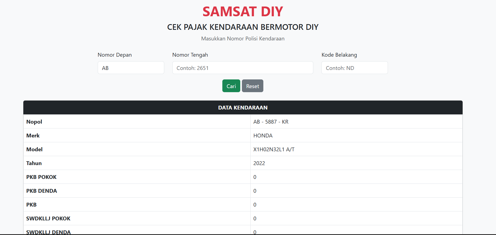

# 🚗 Cek Pajak Kendaraan Bermotor – SAMSAT Sleman (Clone)

Aplikasi web sederhana untuk mengecek data pajak kendaraan berdasarkan **Nomor Polisi**, dibuat menggunakan **Python Flask** dan **Bootstrap 5**, meniru tampilan dari situs SAMSAT Sleman.

---

## 📸 Tampilan Awal


---

## 📦 Fitur

- Form input nomor polisi (3 bagian: kode depan, angka, dan kode belakang)
- Tampilan hasil informasi kendaraan
- Desain responsif dengan Bootstrap 5
- Siap untuk integrasi scraping/API

---

## 🧰 Requirements

- Python 3.7 atau lebih tinggi
- pip

---

## 🚀 Cara Instalasi

### 1. Clone Repository

```bash
git clone https://github.com/username/cek-pajak-kendaraan.git
cd cek-pajak-kendaraan
```
### 2.(Opsional) Buat Virtual Environment

```bash
python -m venv venv
source venv/bin/activate      # Linux / macOS
venv\Scripts\activate         # Windows
```

### 3. Install Dependencies

```bash
py -m pip install -r requirements.txt
```
### 4. Jalankan Aplikasi

```bash
python app.py
```
### 5. Akses dibrowser

## Buka URL http://localhost:5000 di browser.